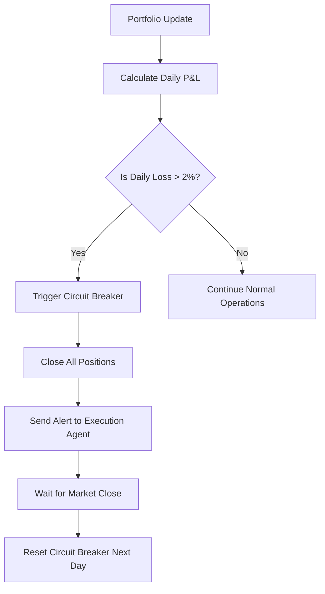
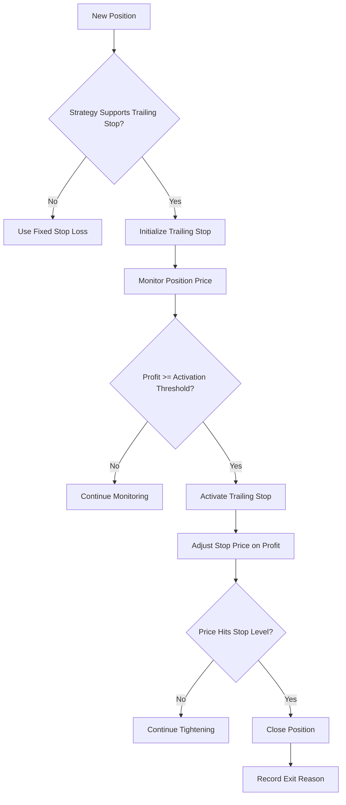
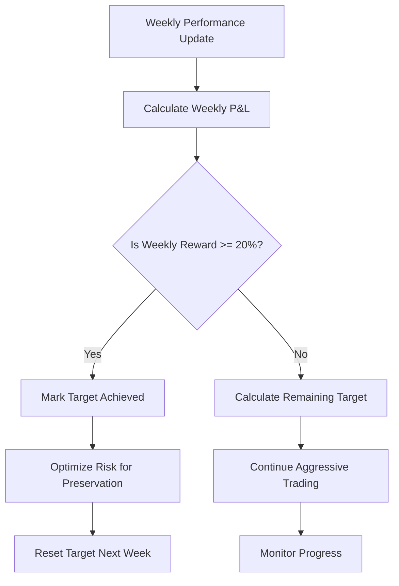

# Risk Management System Workflow

## Overview

The Risk Management System implements a streamlined 2-tier architecture designed to protect portfolio capital while optimizing for performance targets. The system enforces strict daily loss limits, implements trailing stop losses for specific strategies, and tracks weekly reward targets.

## Core Requirements

✅ **Portfolio Daily Loss Limit**: ≤2% maximum daily loss  
✅ **Trailing Stop Loss**: For "trend_following" and "htf" strategies  
✅ **Weekly Reward Target**: ≥20% minimum weekly reward  
✅ **Circuit Breaker Protection**: Automatic position closure on limit breaches  

## System Architecture

```
┌─────────────────────────────────────────────────────────────────┐
│                    RISK MANAGEMENT SYSTEM                       │
├─────────────────────────────────────────────────────────────────┤
│  TIER 1: CONNECTION & MONITORING                              │
│  ┌─────────────────┐ ┌─────────────────┐ ┌─────────────────┐  │
│  │ Connection      │ │ Performance     │ │ Circuit         │  │
│  │ Manager        │ │ Monitor         │ │ Breaker         │  │
│  └─────────────────┘ └─────────────────┘ └─────────────────┘  │
├─────────────────────────────────────────────────────────────────┤
│  TIER 2: RISK PROCESSING & EXECUTION                          │
│  ┌─────────────────┐ ┌─────────────────┐ ┌─────────────────┐  │
│  │ Streamlined     │ │ Trailing Stop   │ │ Portfolio       │  │
│  │ Risk Manager    │ │ Manager         │ │ Performance     │  │
│  └─────────────────┘ └─────────────────┘ └─────────────────┘  │
└─────────────────────────────────────────────────────────────────┘
```

## Component Workflow

### 1. Connection Manager
- **Purpose**: Manages Redis connections and MT5 API connectivity
- **Workflow**: 
  ```
  Initialize → Connect to Redis → Connect to MT5 → Monitor Health
  ```

### 2. Performance Monitor
- **Purpose**: Tracks system performance metrics
- **Workflow**:
  ```
  Collect Metrics → Analyze Performance → Generate Alerts → Update Dashboard
  ```

### 3. Circuit Breaker Manager
- **Purpose**: Prevents cascading failures and enforces hard limits
- **Workflow**:
  ```
  Monitor Thresholds → Detect Breach → Open Circuit → Wait Recovery → Close Circuit
  ```

### 4. Streamlined Risk Manager
- **Purpose**: Core risk processing and decision making
- **Workflow**:
  ```
  Receive Request → Validate → Process Risk → Apply Limits → Return Decision
  ```

### 5. Trailing Stop Manager
- **Purpose**: Manages dynamic stop losses for eligible strategies
- **Workflow**:
  ```
  Initialize Stop → Monitor Price → Activate on Profit → Tighten Stop → Trigger Exit
  ```

### 6. Portfolio Performance Tracker
- **Purpose**: Tracks portfolio-level performance and enforces limits
- **Workflow**:
  ```
  Update Metrics → Check Daily Loss → Check Weekly Target → Trigger Circuit Breaker
  ```

## Risk Management Workflow

### Daily Portfolio Risk Management



### Trailing Stop Loss Workflow



### Weekly Reward Target Tracking



## Strategy-Specific Risk Limits

### Trend Following Strategy
- **Max Position Size**: 15% of portfolio
- **Max Leverage**: 1.2x
- **Stop Loss**: 1% initial
- **Trailing Stop**: ✅ Enabled
  - Distance: 0.5%
  - Activation: 1% profit
  - Tightening: 0.2% increments

### HTF Strategy
- **Max Position Size**: 20% of portfolio
- **Max Leverage**: 1.0x (no leverage)
- **Stop Loss**: 2% initial
- **Trailing Stop**: ✅ Enabled
  - Distance: 1%
  - Activation: 1.5% profit
  - Tightening: 0.5% increments

### Other Strategies
- **Arbitrage**: No trailing stop, 5% max position
- **Market Making**: No trailing stop, 8% max position
- **News Driven**: No trailing stop, 12% max position

## Circuit Breaker Triggers

### Daily Loss Limit Breach (2%)
1. **Detection**: Portfolio daily loss exceeds 2%
2. **Action**: Circuit breaker opens immediately
3. **Response**: Close all positions
4. **Recovery**: Wait 1 hour before allowing new trades
5. **Reset**: Automatic reset at market close

### Performance Thresholds
- **Error Rate**: >1% triggers circuit breaker
- **Cache Hit Rate**: <90% triggers alert
- **Memory Usage**: >80% triggers alert
- **CPU Usage**: >80% triggers alert

## Real-Time Monitoring

### Position Monitoring
- **Interval**: Every 60 seconds
- **Actions**: Update trailing stops, check risk limits
- **Alerts**: Immediate notification on limit breaches

### Portfolio Monitoring
- **Interval**: Every 5 minutes
- **Actions**: Calculate P&L, check daily/weekly targets
- **Alerts**: Circuit breaker activation on limit breaches

### System Health Monitoring
- **Interval**: Every 30 seconds
- **Actions**: Check component health, validate connections
- **Alerts**: System degradation warnings

## Integration Points

### Execution Agent
- Receives risk decisions and circuit breaker actions
- Executes position closures and risk management orders
- Reports execution results back to risk management

### Data Feeds
- Provides real-time price updates for position monitoring
- Supplies market data for risk calculations
- Feeds portfolio value updates for performance tracking

### Redis Communication
- Inter-agent communication hub
- State persistence and caching
- Real-time alert distribution

## Error Handling & Recovery

### Connection Failures
1. **Detection**: Connection timeout or error
2. **Fallback**: Use cached data if available
3. **Recovery**: Automatic reconnection attempts
4. **Escalation**: Alert if persistent failures

### Data Corruption
1. **Detection**: Data validation failure
2. **Action**: Reject corrupted data
3. **Recovery**: Fetch fresh data from source
4. **Logging**: Record corruption details

### System Overload
1. **Detection**: Performance threshold breach
2. **Action**: Activate load balancing
3. **Recovery**: Distribute load across workers
4. **Escalation**: Circuit breaker if persistent

## Performance Optimization

### Adaptive Timing
- **Fast Operations**: Target 50ms for simple validations
- **Comprehensive Operations**: Target 500ms for complex analysis
- **Dynamic Adjustment**: Automatic timeout optimization

### Load Balancing
- **Request Distribution**: Round-robin across workers
- **Priority Handling**: High-priority requests processed first
- **Queue Management**: Maximum 1000 requests in queue

### Caching Strategy
- **Redis Cache**: Store frequently accessed data
- **Cache Hit Target**: >90% hit rate
- **Cache Expiry**: Configurable TTL based on data type

## Testing & Validation

### Unit Testing
- Individual component testing
- Mock data and connection testing
- Error condition simulation

### Integration Testing
- End-to-end workflow testing
- Real data feed integration
- Performance benchmark testing

### Stress Testing
- High-frequency request testing
- Large portfolio simulation
- Market crash scenario testing

## Monitoring & Alerting

### Dashboard Metrics
- Real-time risk exposure
- Performance tracking
- Circuit breaker status
- System health indicators

### Alert Types
- **Info**: Normal operations and status updates
- **Warning**: Approaching limits and thresholds
- **Critical**: Limit breaches and circuit breaker activations

### Notification Channels
- Redis pub/sub for real-time updates
- Log files for audit trails
- External monitoring systems integration

## Configuration Management

### Environment Variables
- Redis connection settings
- MT5 API credentials
- Performance thresholds
- Risk limits

### Configuration Files
- Strategy-specific risk parameters
- Circuit breaker settings
- Load balancer configuration
- Performance monitoring thresholds

### Runtime Updates
- Dynamic configuration updates
- Hot-reload capability
- Configuration validation

## Security Considerations

### Data Protection
- Encrypted Redis connections
- Secure API authentication
- Audit logging for all operations

### Access Control
- Role-based permissions
- API endpoint security
- Internal communication encryption

### Risk Limits
- Hard-coded maximum limits
- Configurable warning thresholds
- Automatic enforcement mechanisms

## Future Enhancements

### Machine Learning Integration
- Dynamic risk limit adjustment
- Market regime detection
- Automated strategy optimization

### Advanced Analytics
- Risk factor decomposition
- Correlation analysis
- Stress testing automation

### External Integrations
- Third-party risk management tools
- Regulatory reporting systems
- Market data providers

## Conclusion

The Risk Management System provides comprehensive protection for trading portfolios while maintaining performance optimization capabilities. Through its streamlined architecture, real-time monitoring, and automated circuit breakers, it ensures that the system never exceeds the 2% daily loss limit while actively pursuing the 20% weekly reward target.

The system's modular design allows for easy maintenance and enhancement, while its robust error handling ensures reliable operation even under adverse market conditions.
